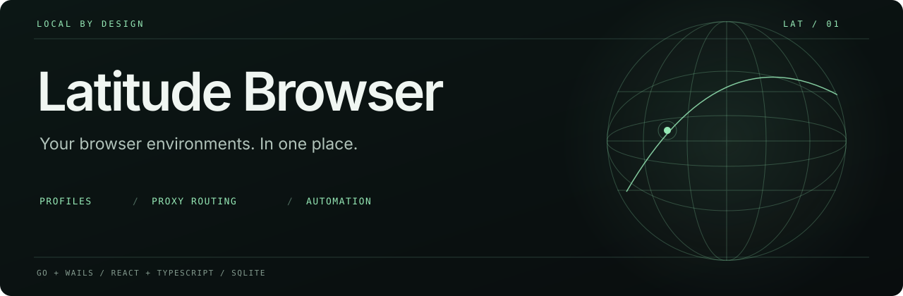
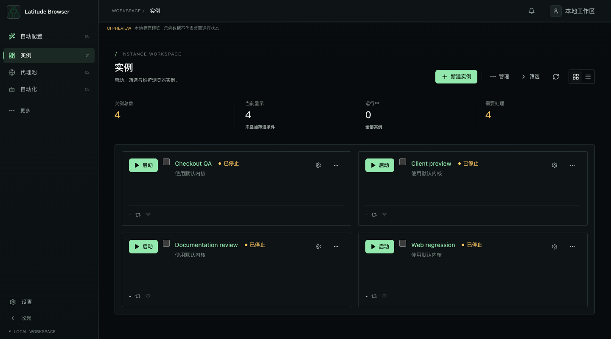
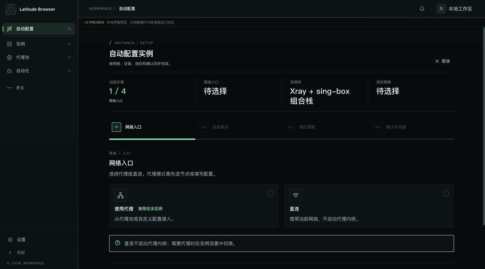
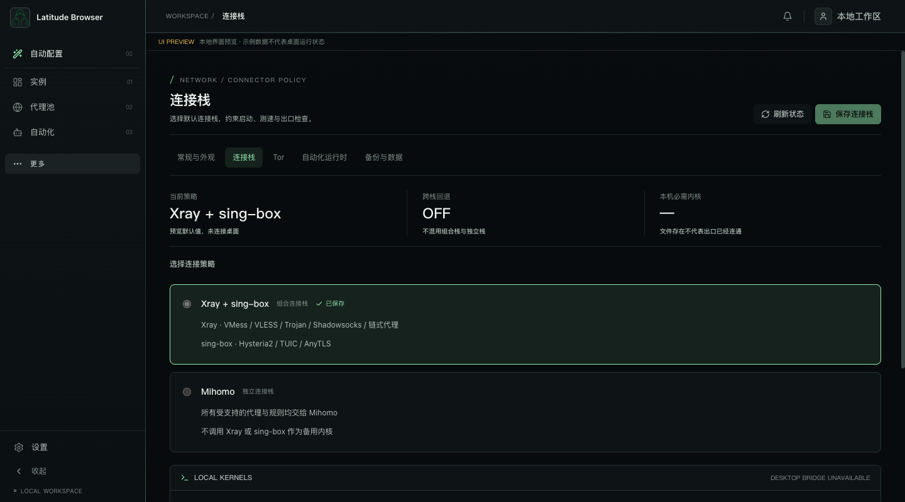

<p align="center"></p>

<p align="center"><strong>把独立浏览器环境、代理连接与自动化，放进一个本地工作台。</strong><br />A local desktop workspace for browser profiles, proxy routing, and automation.</p>

<p align="center">
  <a href="https://github.com/djblack1209-coder/Latitude-Browser/actions/workflows/ci.yml"></a>
  <a href="LICENSE-SCOPE.md"></a>
  
  
  
</p>

<p align="center">简体中文 · <a href="README.en.md">English</a> · <a href="docs/showcase/ENGINEERING.md">工程导览</a> · <a href="docs/showcase/DEMO.md">五分钟演示</a> · <a href="ROADMAP.md">Roadmap</a></p>

## 为什么做 Latitude

调试多个身份、地区或站点环境时，浏览器配置、代理客户端和脚本往往分散在不同工具里。Latitude 将它们组织为可命名、可检索、可单独启动的浏览器实例，适合本地 Web 测试、环境复现和可信脚本自动化。

本项目基于 [black-ant/Ant-Browser](https://github.com/black-ant/Ant-Browser) 持续改造。Latitude 的工作包括终端风格界面、分步环境配置、连接栈与网络状态处理、macOS 安装入口及工程验证。它不是从零编写的 Chromium 内核；[工程导览](docs/showcase/ENGINEERING.md) 区分上游基础、可追溯的改动和后续工作。

## 看一眼工作台



<p align="center"><sub>当前代码的浏览器 UI 预览，使用虚构演示数据；不是已启动浏览器、真实代理出口或桌面集成测试的证明。</sub></p>

<details>
<summary><strong>查看分步配置与连接栈</strong></summary>





</details>

## 可以做什么

| 能力 | 使用方式 | 实现入口 |
| --- | --- | --- |
| 独立浏览器实例 | 管理配置目录、启动参数、标签与代理绑定 | [实例管理](backend/internal/browser/profile_store.go) |
| 分步配置 | 从网络入口、设备基线到指纹策略，最后确认创建 | [AutoConfigPage](frontend/src/modules/browser/pages/AutoConfigPage.tsx) |
| 两套连接栈 | 明确选择 Xray + sing-box 或独立 Mihomo | [连接栈约定](docs/proxy-connector-stacks.md) |
| 启动与诊断 | 组织启动计划，检查运行状态并报告错误 | [启动准备](backend/app_instance_start_prepare.go) |
| 本地自动化 | 通过脚本包与本地 API 驱动自己的测试流程 | [脚本包说明](backend/internal/automation/demo-library/README.md) |
| 本地数据管理 | SQLite 配置、备份与恢复入口 | [备份入口](backend/app_backup_entry.go) |

配置隔离不等于安全沙箱，也不保证匿名性或绕过站点检测。自动化脚本以当前用户权限执行，仅运行自己检查并信任的代码。

## 快速开始

### 先看界面

需要 Node.js 22 与 npm。请先阅读[许可范围](LICENSE-SCOPE.md)。

```bash
git clone --depth 1 https://github.com/djblack1209-coder/Latitude-Browser.git
cd Latitude-Browser/frontend
npm ci
npm run demo
```

打开终端显示的本地地址（默认 `http://127.0.0.1:5218`）。`demo` 显式开启仅限开发环境的模拟状态，并显示提示；普通启动或生产构建缺少桌面服务时会停止业务操作。预览不会启动桌面浏览器进程；实际启动、代理和本地文件操作需要 Wails 桌面运行时。仓库包含固定版本的代理二进制，首次克隆体积较大。

### 开发与检查

从仓库根目录运行：

```bash
npm --prefix frontend run build:clean
npm --prefix frontend test
go test ./...
python3 tools/check-showcase.py
```

Go 工具链固定为 `go.mod` 中的 1.26.8；CI 使用同一版本。桌面开发还需要 Wails v2.12.0 和各系统的原生依赖，参见 [Wails 官方安装说明](https://wails.io/docs/gettingstarted/installation)。Windows 入口为 `bat\dev.bat`；[macOS 构建说明](publish/mac/README.md) 与 [Linux 构建说明](publish/linux/README.md) 单独维护。macOS 正式安装入口为 `/Applications/Latitude Browser.app`。

**目前没有本仓库发布的可下载 Release。** Windows/Linux/macOS 有相应实现与打包入口；这不表示各平台都完成了本轮原生验收。macOS 签名、公证及跨平台发布仍列在 [Roadmap](ROADMAP.md)。

## 从哪里读代码

```text
frontend/src/                 React 页面、状态与桌面桥接
backend/                     Wails API 与应用用例编排
backend/internal/browser/    实例、内核、配置与浏览器进程
backend/internal/proxy/      连接栈、协议转换、检测与桥接进程
backend/internal/automation/ 本地脚本运行时
backend/internal/database/   SQLite 持久化
publish/                     平台打包与运行时版本清单
```

[工程导览](docs/showcase/ENGINEERING.md) 包含架构图、请求路径、设计取舍和可复核的提交；[后端修复说明](docs/showcase/HARDENING.md) 记录数据一致性、API/CDP 认证、下载校验和进程生命周期的回归依据；[演示指南](docs/showcase/DEMO.md) 给出从界面到代码的讲解顺序。

## 参与和支持

欢迎提交可复现的 [Bug](https://github.com/djblack1209-coder/Latitude-Browser/issues/new?template=bug_report.yml)、使用建议或文档改进。请先阅读 [贡献指南](CONTRIBUTING.md)；敏感问题参见 [安全说明](SECURITY.md)。

如果这个工作台对你有帮助，欢迎点一颗 **Star**，或分享你的使用场景。具体反馈会帮助决定下一步优先完善什么。

## 免费使用与许可

感谢 [Ant-Browser](https://github.com/black-ant/Ant-Browser) 的项目基础，以及 [fingerprint-chromium](https://github.com/adryfish/fingerprint-chromium)、[Wails](https://github.com/wailsapp/wails)、[Xray-core](https://github.com/XTLS/Xray-core)、[sing-box](https://github.com/SagerNet/sing-box) 和 [Mihomo](https://github.com/MetaCubeX/mihomo)。

本仓库维护者有权许可的原创贡献采用 [PolyForm Noncommercial 1.0.0](LICENSE)：**非商业用途免费，不授予商业使用权**。带有禁止商用限制，因此准确称为“源码可见”，不宣称是 OSI 定义的开源软件。具体适用范围见 [LICENSE-SCOPE](LICENSE-SCOPE.md)。

上游 Ant-Browser 仍未附独立 LICENSE，维护者的授权不能代替上游授权。Xray、sing-box、Mihomo 等第三方组件保留其原有许可证及权利，不受本仓库的非商业限制重新约束。来源记录见[迁移说明](docs/plan/source-migration-and-license.md)，第三方归属见 [NOTICE](third_party/NOTICE.md)。
