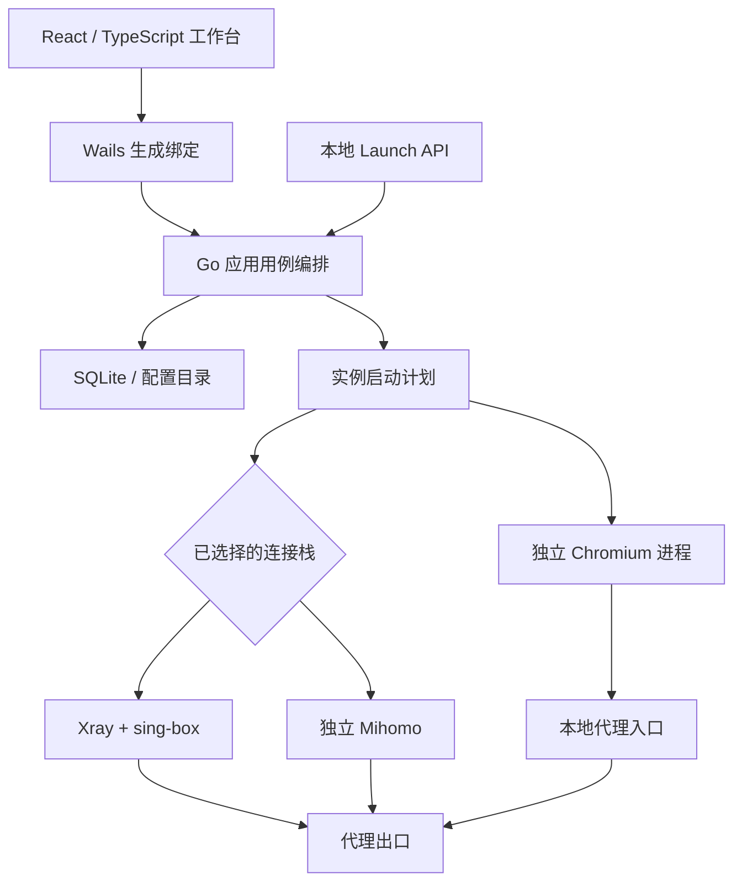

# Latitude Browser · 工程导览

[返回首页](../../README.md) · [五分钟演示](DEMO.md) · [Roadmap](../../ROADMAP.md)

这份导览面向第一次阅读项目的开发者。分析基线为 `e90e35d`；这一轮 GitHub 展示改动基于该提交，未将另一个工作区中尚未提交的修复当作已发布功能。

## 项目边界

Latitude 是 Go/Wails 桌面工作台：React 负责配置与交互，Go 编排浏览器进程、代理桥接和本地数据。Chromium 是被管理的浏览器进程，Xray、sing-box、Mihomo 是相应连接栈的运行时。

它适合需要反复配置多个本地 Web 测试环境的人。普通浏览器多用户配置足以处理简单身份切换；Playwright 等测试工具适合以代码为中心的测试任务。Latitude 值得维护的部分是将配置、进程状态和网络诊断组织成连续的桌面工作流。它暂未建立团队 SaaS、远程设备管理或商业支持闭环。

## 架构与一次启动

图中代理路径为概念结构；直连实例不经代理。两套连接栈不会自动互相回退。

1. 用户选择已有实例或在分步配置中创建实例。
2. React 通过 Wails 绑定调用 Go 应用层；普通网页预览没有这个桌面运行时。
3. 应用层解析实例、内核、数据目录、启动参数和有效代理，形成启动计划。
4. 所选连接栈准备对应桥接；浏览器进程使用本地入口启动。
5. 应用更新状态、记录失败并处理停止与资源清理。

建议依次阅读 [AutoConfigPage](../../frontend/src/modules/browser/pages/AutoConfigPage.tsx)、[前端桥接](../../frontend/src/modules/browser/api/runtime.ts)、[启动准备](../../backend/app_instance_start_prepare.go) 和 [代理栈约定](../proxy-connector-stacks.md)。

## 可以深入讨论的工程问题

| 问题 | 当前实现入口 | 值得解释的取舍 |
| --- | --- | --- |
| 怎样将复杂参数变成可理解的配置流程？ | [四步配置页](../../frontend/src/modules/browser/pages/AutoConfigPage.tsx)、[导航配置](../../frontend/src/config/navigation.config.ts) | 按任务组织入口；设备基线与指纹策略分开；创建前明确确认 |
| 为什么不能把所有代理都理解为 Xray？ | [协议解析](../../backend/internal/proxy/parser.go)、[Xray 配置](../../backend/internal/proxy/xray_runtime_config.go) | `xray` 代表组合栈；hysteria2/tuic/anytls 等由 sing-box 承担；独立 Mihomo 保持语义一致 |
| 浏览器启动为什么需要计划对象？ | [browserStartPlan](../../backend/app_instance_start_prepare.go) | 配置、进程与网络资源需要协调，失败路径不能只报告一个 PID |
| 桌面预览为什么不能代替集成测试？ | [getBindings](../../frontend/src/modules/browser/api/runtime.ts)、[UI 回归说明](../../frontend/scripts/verify-workspace.mjs) | 网页中没有 Wails；模拟状态能验证布局，不能证明代理和浏览器真正启动 |
| 安装目录与可写状态如何分离？ | [运行路径](../../backend/runtime_paths.go)、[路径模块](../../backend/internal/apppath) | macOS 正式入口稳定，状态独立，保留旧目录兼容 |
| 脚本运行时的信任边界在哪里？ | [自动化模块](../../backend/internal/automation)、[安全说明](../../SECURITY.md) | 可信本地脚本可操作系统；超时和杀进程不是安全沙箱 |

## 上游基础与 Latitude 增量

上游提供浏览器实例管理、代理、自动化及桌面技术栈等基础。保留原始 Git 历史，不将全部代码量记为本仓库维护者独立创作。下面的提交是可核查的本仓库演进；提交归属本身不能替代对每段代码来源的审查。

| 增量 | 提交证据 | 查看重点 |
| --- | --- | --- |
| 工作台界面与 macOS 图标 | [deb57ca](https://github.com/djblack1209-coder/Latitude-Browser/commit/deb57ca) | 页面、图标与原有基础的改造范围 |
| 唯一 macOS 应用入口 | [339636d](https://github.com/djblack1209-coder/Latitude-Browser/commit/339636d) | 安装路径、Bundle 身份和重复入口约束 |
| 工作区简化与代理状态加载 | [ccb5fa0](https://github.com/djblack1209-coder/Latitude-Browser/commit/ccb5fa0) | 信息层级及异步状态 |
| 统一产品品牌 | [922650f](https://github.com/djblack1209-coder/Latitude-Browser/commit/922650f) | 用户可见名称与兼容旧标识的边界 |
| 控制工作台与代理流程 | [e90e35d](https://github.com/djblack1209-coder/Latitude-Browser/commit/e90e35d) | 结合 diff 阅读状态和代理流程；提交标题不等于验收结果 |

## 本轮检查与限制

2026-09-14，在 macOS arm64 的隔离工作树上运行：

- `npm ci` 后执行 `npm run build:clean`：TypeScript 和 Vite 生产构建通过。
- `go test ./backend/...`：通过；Go 工具链为 1.26.0。
- Gitleaks v8.24.3 扫描 `master` 历史：0 个规则命中。规则扫描不能证明不存在所有私人数据。
- 当前浏览器 UI 页面使用演示数据进行截图；与本机用户数据隔离。

本轮没有重新构建、安装或验收原生应用，没有验证真实代理出口，没有执行 Windows/Linux 原生测试。已有本地修复、旧审计结果或历史安装物不计入本轮发布成果。CI 的远程状态以 [Actions](https://github.com/djblack1209-coder/Latitude-Browser/actions/workflows/ci.yml) 为准。

源码仍包含固定代理二进制，首次获取体积较大。上游许可尚未明确，签名、公证、可分发运行时、数据加密和跨机器恢复仍需推进。技术原型与可商业分发产品之间的工作见 [Roadmap](../../ROADMAP.md)。
